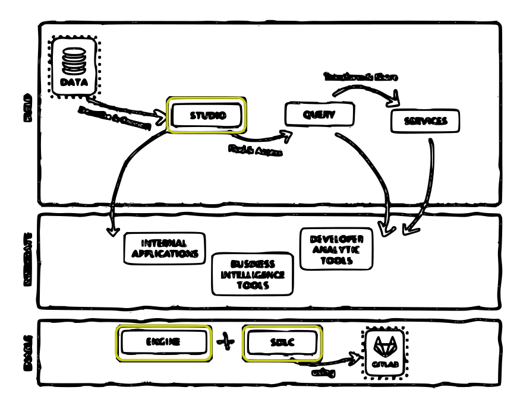

# Current Goal:
## Minimal Maven Install via `Engine`, `SDLC`, and `Studio`
https://github.com/finos/legend/blob/master/installers/maven/README.md?plain=1#L3

- [X] `Engine`
- [ ] `SDLC`
- [ ] `Studio`



### Setup **legend-engine**.
Using previous source build (saved via `publish --address ...`). You probably want this one if you can download the 2.23GB image 😄
```
dagger call -m github.com/jpadams/legend-daggerize-minimal-maven legend-engine --use-cached-container as-service up
```
Purely from source (2-3 hours)
```
dagger call legend-engine --source https://github.com/finos/legend-engine\#master as-service up
```

Test by going to http://localhost:6300 in a browser. The Swagger page can be accessed at http://localhost:6300/api/swagger.

### ISSUES:
I was hitting the issue that several people have encountered: `java.lang.ClassNotFoundException: org.finos.legend.engine.server.Server`. While following docs, you hit a wall after successfully building the project (can take several hours). This is perhaps due to a reorg of the project/class hierarchy such that the documented classpath doesn't work. Maven (and other) docs were updated May 2023 by An Phi, but guessing An was focused on the Omnibus by commit message: https://github.com/finos/legend/tree/master/installers/maven#setup-legend-engine. An also mentions that users should use Docker images or Omnibus in most cases.
- Might build fine in JetBrains IntelliJ (haven't tried yet).
- Feb 2021: https://github.com/finos/legend/issues/309#issuecomment-781003612
- Nov 2022: https://github.com/finos/legend-engine/issues/1173#issuecomment-1319596232 

I'm able to get past it now after looking for classes that implemented a `main` and choosing one that seemed likely because it has a `Server.java` with right hierarchy.
```
legend-engine-config/legend-engine-server/legend-engine-server-http-server/src/main/java/org/finos/legend/engine/server/Server.java
```
found with:
```
grep -r "public static void main" | grep -i server | grep -vi invoker | grep -vi test | grep -v xts
```

### Progress saved:
Since it takes multiple hours to build the project from source via Maven, I saved the container image just before running the `java -cp ... server` command. You can see this used in the `useCachedContainer` invocation above. 2.23 GB! 
https://hub.docker.com/repository/docker/jeremyatdockerhub/legend-engine-poc/tags
`docker.io/jeremyatdockerhub/legend-engine-poc:latest@sha256:5f2c8256faf99174998c5719c8cd35fa5c8abcbff5022efd9f3162fa56a4cae3`

### Notes:
This is a WIP. The `config.yaml` is possibly going to be used later to connect `SDLC` component to `gitlab.com`, so I'll leave it there for now. That's also why the `gettext-base` package was added to the Ubuntu `Container` so I could set env vars on the Container from `Secret` args and use `envsubst` to fill in the template's `$APP_ID` etc.
